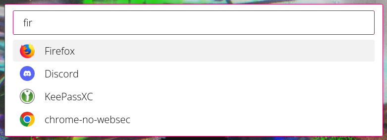

# nifty-launcher

Just another application launcher. Looks something like this:




## Why?

The primary gimmick of Nifty is that it's configured via Javascript module instead of configuration file.

This means that as use-cases of Nifty get more complex, the complexity of the API will only increase a little bit in response. This is a big improvement over the status quo of "starting simple" with a standard config file and eventually drowning in complexity trying to shoehorn in more and more features. (See, for instance, Typescript's `tsconfig.json`.) By choosing Javascript as its "config format", Nifty gives the user a massive amount of flexibility, power, and expresiveness.

You use `nifty` by calling it with a path to your configuration module, eg `nifty /path/to/config.js`. The provided module may use `require('nifty')` to gain access to the Nifty module, which has the type provided below. Also see `example/`.

```
exports :: Exports

type Exports =
  { run :: (Query -> Array Item) -> ()
  , lib :: Lib
  }

type Query = String

type Lib =

  -- | Built-in fuzzy sort
  { sort :: (Array Item, String) -> Array Item

  -- | Make a standard item
  , mkItem ::
      { displayText :: String
      , searchText :: String
      , isSticky [optional] :: Bool
          -- ^ Whether to stick to top of search results
      , exec [optional] :: () -> ()
          -- ^ What to do on select
      , icon [optional] :: String | ""
          -- ^ Icon URI
          --   If omitted, no icon
          --   If '""', empty icon
      }
      -> Item

  -- | Like mkItem, but combines displayText and searchText
  , mkSimple ::
      { text :: String
      , isSticky [optional] :: Bool
      , exec [optional] :: () -> ()
      , icon [optional] :: String | ""
      }
      -> Item
  }
  
type Item =
  { text :: String
      -- ^ Item text
  , exec :: () -> ()
      -- ^ What to do when the item is selected
  , render :: ({ isSelected :: Bool }) -> Node
      -- ^ Render to a DOM node
  , isSticky :: Bool
      -- ^ Sticks to top of sort
  }
```


## How to run it

Install [nwjs](https://github.com/nwjs/nw.js) however you like

```
npm i
nw . -- ./example/example.js
```
